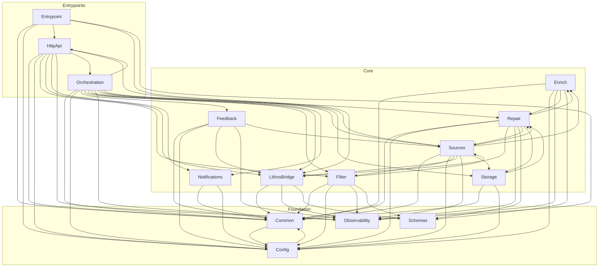

<!-- AUTOGENERATED by tests/meta — do not edit by hand.
     Regenerate with `make diagrams` (or `pytest tests/meta`). -->

# Component dependencies

```mermaid
graph TD
  subgraph Core
    Enrich
    Feedback
    Filter
    LithosBridge
    Notifications
    Repair
    Sources
    Storage
  end
  subgraph Entrypoints
    Entrypoint
    HttpApi
    Orchestration
  end
  subgraph Foundation
    Common
    Config
    Observability
    Schemas
  end
  Common --> Config
  Config --> Common
  Enrich --> Common
  Enrich --> Config
  Enrich --> Observability
  Enrich --> Repair
  Enrich --> Schemas
  Entrypoint --> Common
  Entrypoint --> Config
  Entrypoint --> HttpApi
  Entrypoint --> LithosBridge
  Entrypoint --> Observability
  Feedback --> Common
  Feedback --> Config
  Feedback --> LithosBridge
  Feedback --> Observability
  Feedback --> Sources
  Filter --> Common
  Filter --> Config
  Filter --> Observability
  Filter --> Schemas
  Filter --> Sources
  HttpApi --> Common
  HttpApi --> Config
  HttpApi --> Filter
  HttpApi --> LithosBridge
  HttpApi --> Notifications
  HttpApi --> Observability
  HttpApi --> Orchestration
  HttpApi --> Sources
  LithosBridge --> Common
  LithosBridge --> Observability
  LithosBridge --> Schemas
  Notifications --> Common
  Notifications --> Config
  Orchestration --> Common
  Orchestration --> Config
  Orchestration --> Feedback
  Orchestration --> Filter
  Orchestration --> HttpApi
  Orchestration --> LithosBridge
  Orchestration --> Notifications
  Orchestration --> Observability
  Orchestration --> Repair
  Orchestration --> Sources
  Orchestration --> Storage
  Repair --> Common
  Repair --> Config
  Repair --> Enrich
  Repair --> LithosBridge
  Repair --> Observability
  Repair --> Schemas
  Repair --> Sources
  Repair --> Storage
  Sources --> Common
  Sources --> Config
  Sources --> Enrich
  Sources --> Filter
  Sources --> LithosBridge
  Sources --> Observability
  Sources --> Repair
  Sources --> Storage
  Storage --> Common
  Storage --> Config
  Storage --> Repair
```
